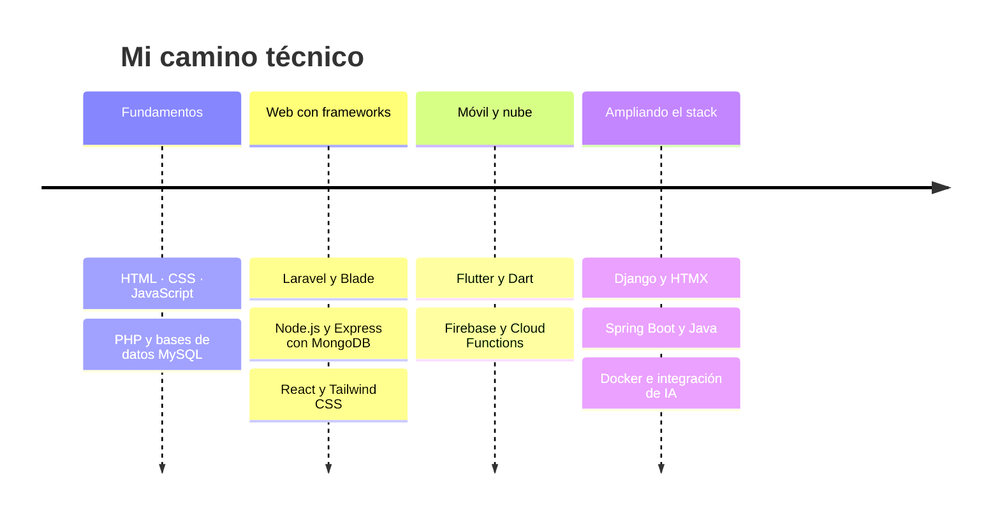

<!-- ═══════════════ ENCABEZADO ═══════════════ -->

 

 

<!-- ═══════════════ SOBRE MÍ ═══════════════ -->
## 👨‍💻 Sobre mí

Soy desarrollador de software y me gusta construir sistemas completos: la base de datos, las reglas de negocio, la API y la interfaz. Mis proyectos son aplicaciones reales de gestión, con **usuarios y roles, pagos en línea, reportes en PDF y Excel, notificaciones y pruebas automatizadas**.

Cuando migro o construyo algo, verifico las reglas de negocio contra los datos reales del cliente. En uno de mis sistemas, por ejemplo, validé cada fórmula de cuotas, mora y ganancia contra el Excel original antes de darla por buena.

<table>
<tr>
<td width="50%" valign="top">

### 🎯 Lo que hago
- Aplicaciones web de gestión con panel por roles
- Apps móviles multiplataforma con backend serverless
- APIs REST seguras con autenticación y validación
- Integración de pagos, correo y servicios de IA
- Reportes exportables (PDF y Excel)

</td>
<td width="50%" valign="top">

### 🧭 Cómo trabajo
- Código organizado por capas (controladores, servicios, repositorios)
- Seguridad desde el diseño: roles, auditoría, límite de peticiones
- Pruebas con **PHPUnit**, **Jest** y **flutter test**
- Documentación del plan y del estado de cada proyecto
- Control de versiones con Git, un commit por fase

</td>
</tr>
</table>

 

<!-- ═══════════════ STACK ═══════════════ -->
## 🛠️ Tecnologías

| | |
|:--|:--|
| **Backend** |  |
| **Frontend** |  |
| **Móvil** |  |
| **Datos y nube** |  |
| **Herramientas** |  |

<b>🔎 Desglose: qué he hecho con cada tecnología</b>

 

| Tecnología | Lo que he construido con ella |
|---|---|
| **Laravel 13 + Filament 3** | Sistema de microcréditos: clientes, préstamos, cronograma de cuotas, kardex de cuentas, importación masiva desde hojas de cálculo y solicitudes mediante enlaces firmados |
| **Laravel + Blade + Breeze** | Plataforma inmobiliaria con catálogo, filtros, favoritos y matriz de permisos por rol |
| **Spatie (Permission y Activitylog)** | Control de acceso por roles y auditoría de cambios |
| **React 19 + Tailwind CSS 4** | Interfaces por rol (cliente, asesor y administrador), formularios y flujo de pagos |
| **Node.js + Express 5** | API REST con JWT en cookies seguras, `helmet`, límite de peticiones, validación y tareas programadas con `node-cron` |
| **MongoDB + Mongoose** | Modelo de inmuebles, citas, reservas, contratos, ventas y auditoría |
| **Stripe** | Pagos, tarjetas guardadas y webhooks con verificación de firma |
| **Flutter + Dart** | App móvil multi-barbería con cuatro roles, citas pagadas, productos y calificaciones |
| **Firebase** | Auth, Firestore, Storage, mensajería push y App Check, con reglas de seguridad propias |
| **Cloud Functions + TypeScript** | Lógica de pagos, reembolsos, mensualidades y recordatorios automáticos |
| **Django + HTMX** | Plataformas educativas con repetición espaciada, ejercicios de código y progreso por usuario |
| **Spring Boot + Docker** | Plataforma de estudio de Spring Boot con Maven y `docker-compose` |
| **IA generativa (Gemini)** | Chatbot asistente, búsqueda de inmuebles en lenguaje natural y generación de descripciones |
| **PHPUnit · Jest · flutter test** | Pruebas unitarias y de integración en los proyectos principales |

 

<!-- ═══════════════ PROYECTOS ═══════════════ -->
## 🚀 Proyectos destacados

 

 

### 💈 Barber · App multi-barbería
Plataforma móvil donde varias barberías conviven con sus dueños, barberos y clientes, supervisadas por un administrador.
- Reserva y pago de citas con **bloqueo transaccional** del horario, para evitar reservas dobles
- Recordatorios automáticos, aplazamiento de citas cuando el barbero no regresa y cierre de tienda por eventos externos
- Productos con código de reclamo, calificaciones y **moderación automática** de comentarios
- Mensualidad por barbería con periodo de gracia y bloqueo automático
- Reglas de seguridad de Firestore/Storage y lógica sensible en **Cloud Functions**

`Flutter` `Dart` `Firebase` `Cloud Functions` `TypeScript` `Jest`

### 🏠 Inmobiliaria · React + Node
Plataforma inmobiliaria completa con tres paneles: cliente, asesor y administrador.
- API REST con autenticación **JWT en cookies httpOnly**, `helmet` y límite de peticiones
- Citas con franjas configurables, reservas, contratos y ventas
- Pagos con **Stripe**, tarjetas guardadas y webhooks
- Reportes en **PDF y Excel**, estadísticas y auditoría
- Asistente con **IA (Gemini)**: chatbot y búsqueda de inmuebles en lenguaje natural

`React 19` `Node.js` `Express 5` `MongoDB` `Stripe` `Tailwind CSS 4`

### 🏡 Inmobiliaria · Laravel
Migración de un MVP en PHP nativo a Laravel 13, conservando su identidad visual y sus reglas de negocio.
- Gestión de usuarios con roles, perfil y recuperación de contraseña
- Catálogo público con filtros, favoritos y galería de imágenes
- Reportes y gráficas

`Laravel 13` `Blade` `Tailwind CSS 4` `MySQL` `Chart.js`

### 📚 Aprendesoft · Plataformas de estudio
Colección de plataformas educativas, una por tecnología (Django, Laravel y Spring Boot). La de Dart y Flutter aplica **repetición espaciada (método Leitner)** y evaluación de código con 11 tipos de pregunta.

`Django` `HTMX` `Spring Boot` `Laravel` `Docker`

### 🔒 Sistema de microcréditos *(proyecto privado)*
Sistema de gestión para una empresa de créditos: clientes, préstamos, cuotas, cuentas de pago, reportes en PDF, importación masiva y formulario público con enlace firmado y autorización de datos personales conforme a la Ley 1581 de 2012. Roles de administrador, sub-administrador y asesor, con auditoría.

`Laravel 13` `Filament 3` `MySQL` `Spatie` `PHPUnit`

 

<!-- ═══════════════ RUTA DE APRENDIZAJE ═══════════════ -->
## 📚 Formación y ruta de aprendizaje

Aprendo construyendo. Para cada tecnología nueva armo mi propia plataforma de estudio y la subo a [`aprendesoft`](https://github.com/aldemarferreira347-creator/aprendesoft).

 

<!-- ═══════════════ ESTADÍSTICAS ═══════════════ -->
## 📊 Actividad en GitHub

  

 

<picture>
  <source media="(prefers-color-scheme: dark)" srcset="https://raw.githubusercontent.com/aldemarferreira347-creator/aldemarferreira347-creator/output/github-snake-dark.svg" />
  <source media="(prefers-color-scheme: light)" srcset="https://raw.githubusercontent.com/aldemarferreira347-creator/aldemarferreira347-creator/output/github-snake.svg" />
  
</picture>

 

<!-- ═══════════════ CONTACTO ═══════════════ -->
## 🤝 Hablemos

¿Tienes una idea, un sistema que digitalizar o una vacante? Escríbeme.

  

